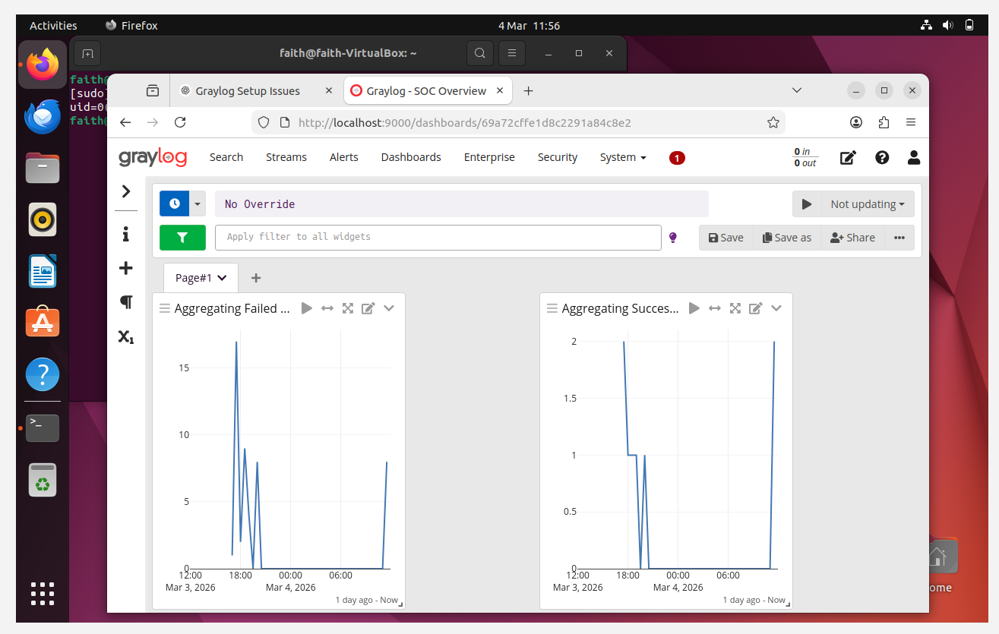
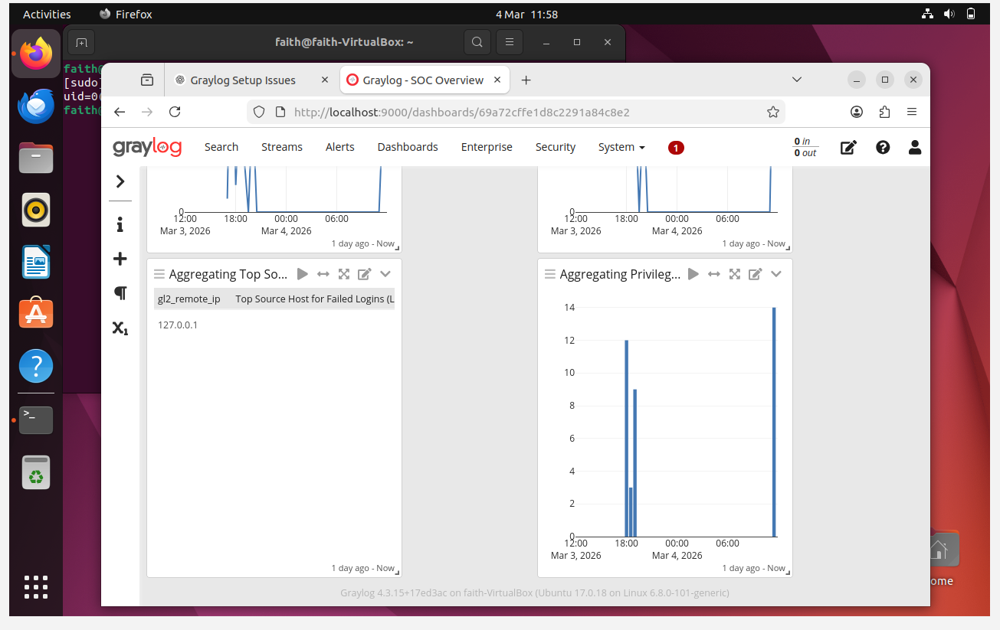
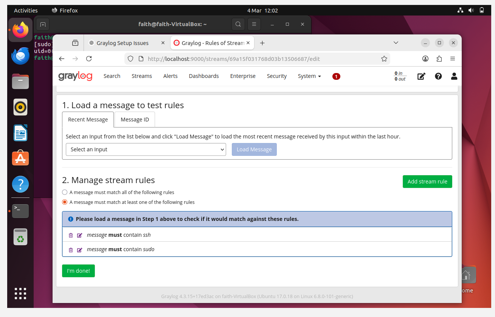
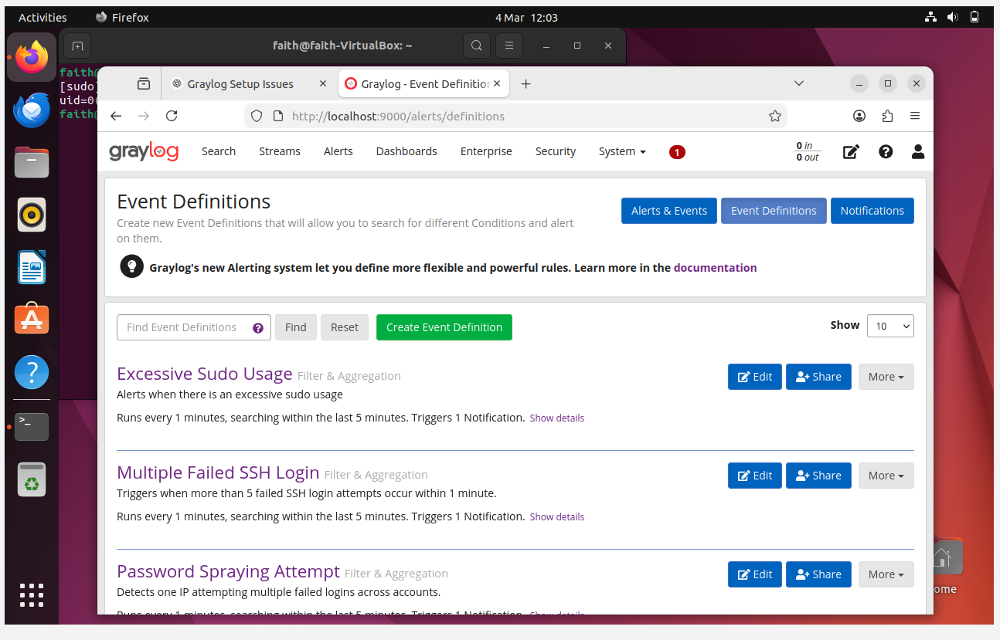
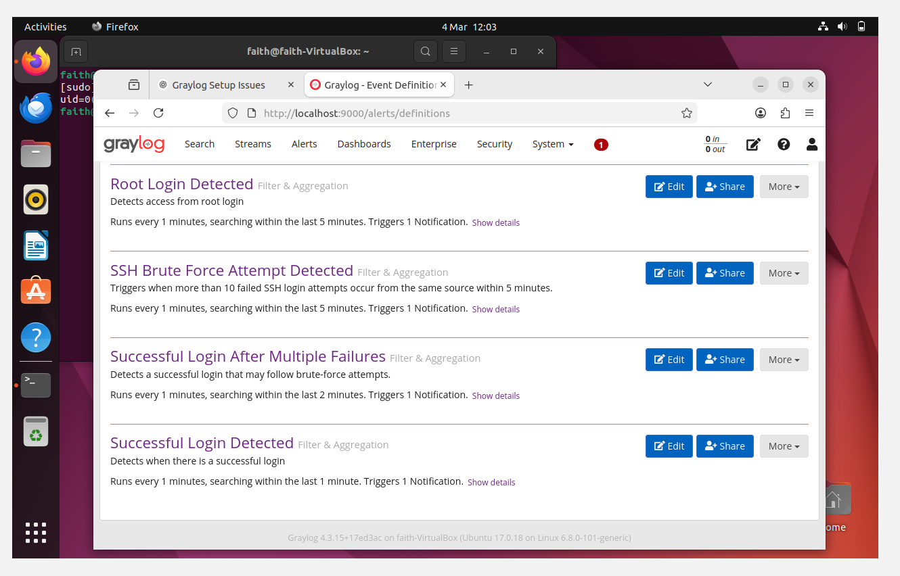
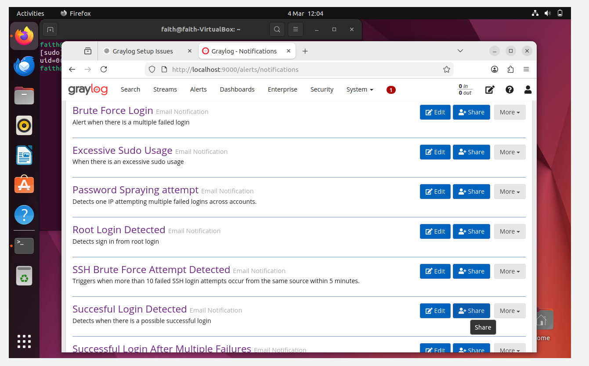
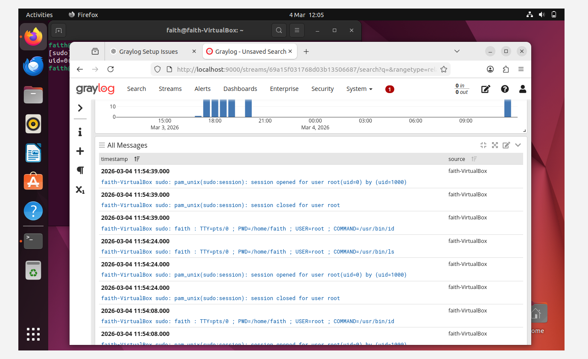
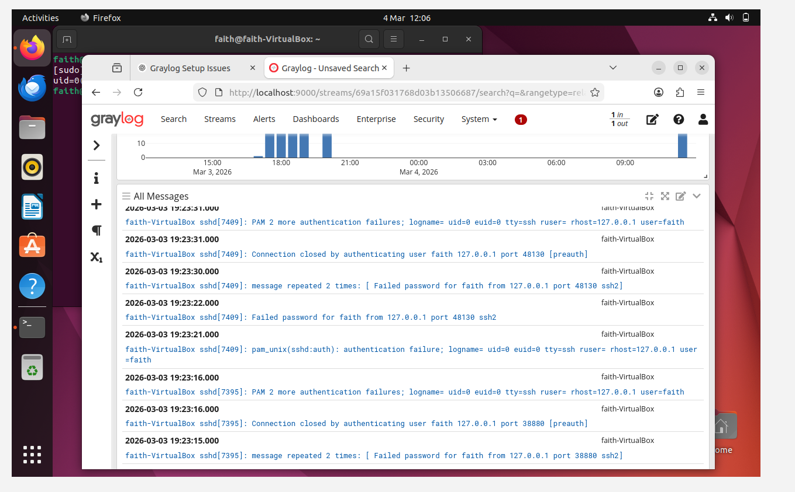

# soc-graylog-soc-lab
SOC monitoring lab built using Graylog, OpenSearch, and Ubuntu. Includes log ingestion, detection engineering, alerting, and dashboards.

## Project Overview

This project demonstrates a small Security Operations Center (SOC) monitoring environment built using **Graylog**. The lab collects system authentication logs, detects suspicious activities, generates alerts, and visualizes security events on a dashboard.

The objective of this project is to simulate real-world **security monitoring and detection engineering** tasks performed by SOC analysts.

---

## Lab Architecture

The SOC lab consists of a single Ubuntu system generating authentication logs which are forwarded to a Graylog server using rsyslog over Syslog TCP.

Graylog processes the logs, applies detection rules, and stores indexed log data in OpenSearch for searching and analysis. MongoDB is used by Graylog to store configuration and metadata.

When suspicious activity is detected, Graylog triggers alerts and sends email notifications to the analyst.

Log Flow:

Ubuntu System Logs
↓
rsyslog (Syslog TCP)
↓
Graylog SIEM
↓
Detection Rules / Streams
↓
OpenSearch (Log Storage)
↓
Alert Notifications (Email)

## Technologies Used

- Graylog 4.3.15
- OpenSearch 1.3.x
- MongoDB 7.0
- Ubuntu 22.04
- rsyslog
- Gmail SMTP (Email Alerts)

---

## Key Features

- Centralized log collection
- SSH authentication monitoring
- Brute force attack detection
- Privilege escalation monitoring
- Email alert notifications
- Security dashboard visualization

---

## Detection Rules Implemented

1. SSH Brute Force Detection  
2. Successful SSH Login Monitoring  
3. Sudo Privilege Escalation Monitoring  

---

## Example Alerts

The system generates alerts when suspicious activity is detected such as:

- Multiple failed login attempts
- Multiple failed login attempts then a successful attempt from same IP address
- Successful login after brute-force attempts
- Unauthorized sudo activity

---

## Incident Response and Remediation

When a detection rule is triggered, Graylog generates an alert and sends an email notification to the analyst.

In a real SOC environment, these alerts would typically create incident tickets in an incident management platform such as ServiceNow or Jira for investigation.

Typical analyst response workflow:

1. Alert is received via email notification.
2. Analyst reviews the logs in Graylog.
3. The source IP and user activity are investigated.
4. If malicious activity is confirmed, remediation actions may include:
   - Blocking the attacker IP address
   - Disabling compromised user accounts
   - Investigating additional related logs

This project simulates the detection and alerting phase of the SOC workflow while demonstrating how incidents would be investigated and mitigated.

## SOC Dashboard

The dashboard provides visualization of security activity including:

- Failed SSH login attempts
- Successful logins
- Sudo command activity
- Log source distribution

---

## Repository Structure

Graylog-SOC-Lab
│
├── README.md
├── documentation
│ ├── setup-process.md
│ ├── detection-rules.md
│ └── testing-scenarios.md
│
└── screenshots

---

## Skills Demonstrated

- Security monitoring
- Log analysis
- SIEM configuration
- Detection rule creation
- Alerting and incident detection
- SOC dashboard creation

---

## Future Improvements

- Add Windows event log monitoring
- Integrate threat intelligence feeds
- Implement log pipelines
- Add correlation rules

---

## Author

Faith Okonoboh

## Screenshots

### Graylog Dashboard

### Stream Rules

### Event Definitions

### Alert Notification

### Logs

